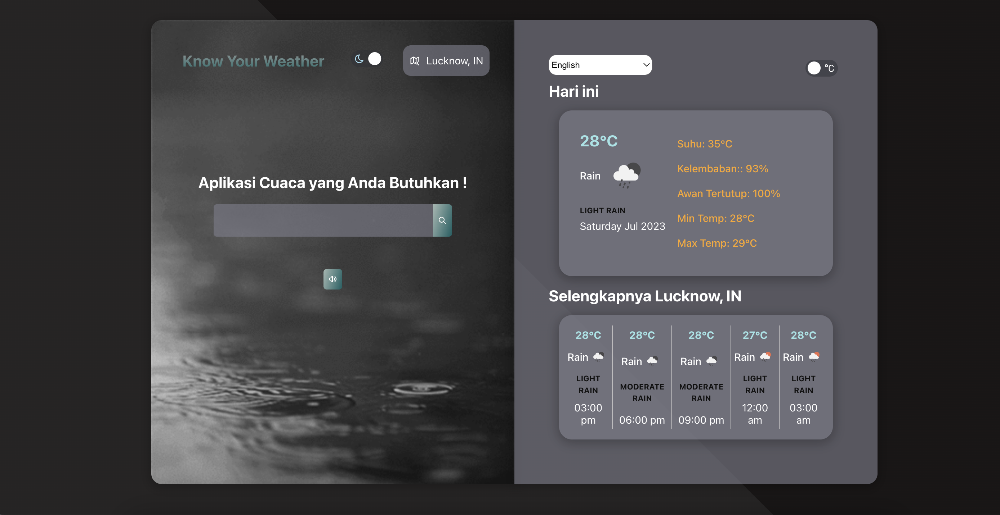

# Know You Whether

This is a simple weather application created using React. It provides real-time weather information for a given location.

## Features
- Fetches weather data from a weather API
- Displays current weather conditions including temperature, humidity, wind speed, and description
- Allows users to search for weather information by location
- Supports both metric and imperial units of measurement

## Technologies Used
- `React` :  A JavaScript library for building user interfaces

- `Axios` : A promise-based HTTP client for making API requests
- `Bootstrap` : A CSS framework for building responsive and mobile-first websites
 - `OpenWeather API` : Provides weather data and forecasts for various locations
- `Material UI`: A CSS framework for building responsive and mobile-first websites
- `I18next` : 
i18next is an internationalization-framework written in and for JavaScript
- `Gsap` : A robust JavaScript toolset for animation.
- `Antd` : An enterprise-class UI design language and React UI library.
- `React-icons`: Include popular icons in  React projects
- `react-player` : A React component for playing a variety of URLs, including file paths, YouTube, Facebook, Twitch, SoundCloud, Streamable, Vimeo, Wistia and DailyMotion

### Installation

To run the Weather App locally, follow these steps:
- Clone the repository: git clone `https://github.com/Priya31Gupta/whether-web.git`

- Navigate to the project directory: cd weather-app

- Install the dependencies: npm install

- Obtain an API key from OpenWeather API by signing up at `https://openweathermap.org/`

- Create a .env file in the project root directory and add your API key: `REACT_APP_API_KEY=your-api-key`

- Start the development server: npm start

- Open a web browser and visit http://localhost:3000
### Configuration

The application uses environment variables to store the API key and other configuration settings. These variables are defined in the .env file.

`REACT_APP_API_KEY` = Your API key obtained from OpenWeather API  

`REACT_APP_ICON_URL` = http://openweathermap.org/img/wn/   

`REACT_APP_URL` = The base URL for the [weather API ]( https://api.openweathermap.org/data/2.5)

### Usage

- Upon opening the application, the user is presented with the current weather conditions for their current location.

- The user can search for weather information by entering a location in the search bar and pressing Enter or clicking the search button.

- The application fetches the weather data from the API and displays the current conditions.

- The user can toggle between Celsius and Fahrenheit units using the unit switcher button.

## Live-Preview - [Live](https://whether-web.vercel.app/)

### Sample Image 

# Contributing
Contributions to the Weather App are welcome! If you find a bug or want to add a new feature, please open an issue or submit a pull request.
